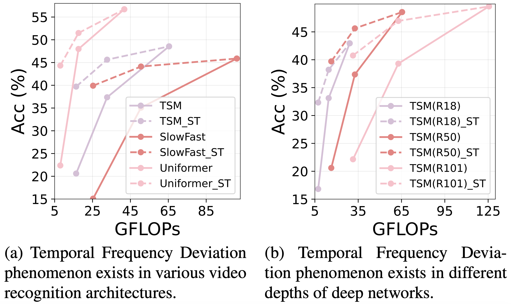
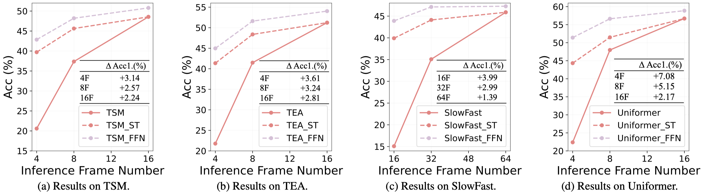
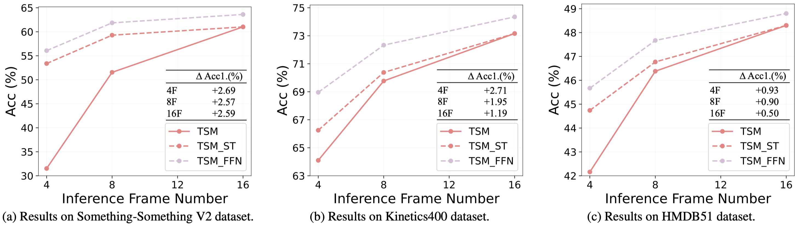

# Frame Flexible Network (CVPR2023)


<div align="left">
    <a></a>
    <a></a>
    <a></a>
</div>

[arXiv](https://arxiv.org/abs/2303.14817) | Primary contact: [Yitian Zhang](mailto:markcheung9248@gmail.com)

```
@article{zhang2023frame,
  title={Frame Flexible Network},
  author={Zhang, Yitian and Bai, Yue and Liu, Chang and Wang, Huan and Li, Sheng and Fu, Yun},
  journal={arXiv preprint arXiv:2303.14817},
  year={2023}
}
```

<div align="center">
  
</div>

## TL,DR
- `Motivation`: Existing video recognition algorithms always conduct different training pipelines for inputs with different frame numbers, which requires repetitive training operations and multiplying storage costs. 
- `Observation`: Directly evaluating the model at frames which are not used in training, the performance will drop significantly (see Figure above), which is summarized as Temporal Frequency Deviation phenomenon.
- `Solution`: We propose a general framework, named Frame Flexible Network (FFN), which not only enables the model to be evaluated at different frames to adjust its computation, but also reduces the memory costs of storing multiple models significantly.
- `Strength`: (1) One-shot Training (2) Obvious Performance Gain (3) Signficant Parameter Saving (4) Flexible Computation Adjustment


## Datasets
Please follow the instruction of [TSM](https://github.com/mit-han-lab/temporal-shift-module#data-preparation) to prepare the Something-Something V1/V2, Kinetics400, HMDB51 datasets.

## Support Models

FFN is a general framework and can be easily applied to existing methods for stronger performance and higher flexibility during inference. Currently, FFN supports the implementation of 2D Network: [TSM](https://arxiv.org/abs/1811.08383), [TEA](https://openaccess.thecvf.com/content_CVPR_2020/papers/Li_TEA_Temporal_Excitation_and_Aggregation_for_Action_Recognition_CVPR_2020_paper.pdf); 3D Network: [SlowFast](https://openaccess.thecvf.com/content_ICCV_2019/papers/Feichtenhofer_SlowFast_Networks_for_Video_Recognition_ICCV_2019_paper.pdf); Transformer Network: [Uniformer](https://arxiv.org/abs/2201.09450). Please feel free to contact us if you want to contribute the implementation of other methods.

## Result

- Validation Across Architectures
  
<div align="center">
  
</div>

FFN can obviously outperform Separated Training (ST) at all frames on different architectures with significant less parameters on Something-Something V1 dataset.

Here we provide the pretrained models on all these architectures:
| Model | Acc1.($v_{L}$) |  Acc1.($v_{M}$)  | Acc1.($v_{H}$)  |  Weight  |
| --------------- | --------------- | ------------- |------------- | ------------- |
| TSM  | 20.60% | 37.36% | 48.55% | [link](https://drive.google.com/file/d/1CVXl_qKiTB8iaqz4UyErxdNpG2XwZlPH/view?usp=sharing) |
| TSM-ST  | 39.71% | 45.63% | 48.55% | - |
| TSM-FFN  | 42.85% | 48.20% | 50.79% | [link](https://drive.google.com/file/d/1_UhRmFoed58XPTqs8evqZspYEGLNWYdv/view?usp=sharing) |
||
| TEA  | 21.78% | 41.49% | 51.23% | [link](https://drive.google.com/file/d/1pfOgZXR5N5hRy14Ub7FyzBq-BIWFWnBO/view?usp=sharing) |
| TEA-ST  | 41.36% | 48.37% | 51.23% | - |
| TEA-FFN  | 44.97% | 51.61% | 54.04% | [link](https://drive.google.com/file/d/1svAKVJRIEL0bRsgVP9ZOx6n-Yd5tKaYt/view?usp=sharing) |
||
| SlowFast  | 15.08% | 35.08% | 45.88% | [link](https://drive.google.com/file/d/1WW6nirUmVK7AL9EmlkDw8eOWG4wSJlds/view?usp=sharing) |
| SlowFast-ST  | 39.91% | 44.12% | 45.88% | - |
| SlowFast-FFN  | 43.90% | 47.11% | 47.27% | [link](https://drive.google.com/file/d/17zZ_tyAPNx9mz_qu0whhhjlqalElVexS/view?usp=sharing) |
||
| Uniformer | 22.38% | 47.98% | 56.71% | [link](https://drive.google.com/file/d/1r68Z9iUUQDcrpZYdq7kYGd7jflStjD0t/view?usp=sharing) |
| Uniformer-ST  | 44.33% | 51.49% | 56.71% | - |
| Uniformer-FFN  | 51.41% | 56.64% | 58.88% | [link](https://drive.google.com/file/d/1ZlBBEgMA5CJsJCbVfht9ytqY-oD7jEEo/view?usp=sharing) |


- Validation Across Datasets

<div align="center">
  
</div>

FFN can obviously outperform Separated Training (ST) at all frames on different datasets with significant less parameters.

Here we provide the pretrained models on Something-Something V2:
| Model | Parameters | Acc1.($v_{L}$) |  Acc1.($v_{M}$)  | Acc1.($v_{H}$) | Weight  |
| --------------- | --------------- | ------------- |------------- | ------------- | ------------- |
| TSM  | 25.6M | 31.52% | 51.55% | 61.02% | [link](https://drive.google.com/file/d/1S8XQ66oUIp2PEGpD81j_Y-gq0cEV3VwF/view?usp=sharing) |
| TSM-ST  | 25.6x3M | 53.38% | 59.29% | 61.02% | - |
| TSM-FFN  | 25.7M | 56.07% | 61.86% | 63.61% | [link](https://drive.google.com/file/d/1lmKFR-5sO86A1ge7JkWzY0nXkE0it4wo/view?usp=sharing) |

and Kinetics400:
| Model | Parameters | Acc1.($v_{L}$) |  Acc1.($v_{M}$)  | Acc1.($v_{H}$) | Weight  |
| --------------- | --------------- | ------------- |------------- | ------------- | ------------- |
| TSM  | 25.6M | 64.10% | 69.77% | 73.16% | [link](https://drive.google.com/file/d/1g9uyLpPyg0s3AOHsMNBM0G8MhhN1Nx41/view?usp=sharing) |
| TSM-ST  | 25.6x3M | 66.25% | 70.38% | 73.16% | - |
| TSM-FFN  | 25.7M | 68.96% | 72.33% | 74.35% | [link](https://drive.google.com/file/d/17SaTXHI_7bgw1-aT2mpE78rX44hHQ5EL/view?usp=sharing) |


- Inference At Any Frame

<div align="center">
  
</div>

FFN can be evaluated at any frame and outperform Seperated Training (ST) even at frames which are not used in training.


## Get Started

We provide a comprehensive codebase for video recognition which contains the implementation of [2D Network](2D_Network/), [3D Network](3D_Network/) and [Transformer Network](Transformer_Network/). Please go to the folders for specific docs.


## Acknowledgment

Our codebase is heavily build upon [TSM](https://github.com/mit-han-lab/temporal-shift-module#data-preparation), [SlowFast](https://github.com/facebookresearch/SlowFast) and [Uniformer](https://github.com/Sense-X/UniFormer/tree/main/video_classification). We gratefully thank the authors for their wonderful works. The README file format is heavily based on the GitHub repos of my colleague [Huan Wang](https://github.com/MingSun-Tse), [Xu Ma](https://github.com/ma-xu) and [Yizhou Wang](https://github.com/wyzjack). Great thanks to them! We also greatly thank the anounymous CVPR'23 reviewers for the constructive comments to help us improve the paper.
